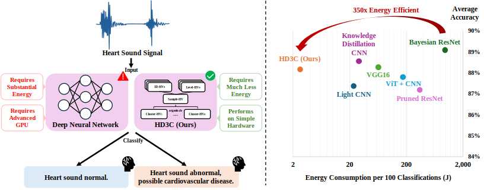
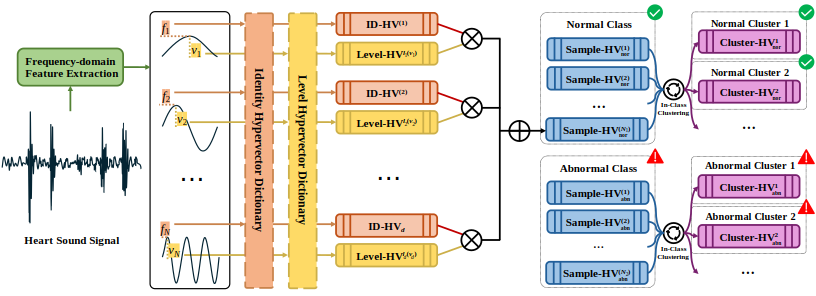

# HD3C: Hyperdimensional Computing with In-Class Clustering

[](https://www.python.org/downloads/release/python-3100/)
[](https://numpy.org/)
[](https://opensource.org/licenses/MIT)

## 1. Overview

This repository provides the official implementation of **HD3C**, a 
Hyperdimensional Computing (HDC) framework designed for classification tasks on 
low-power and resource-constrained systems.

When applied to heart sound classification, HD3C achieves accuracy comparable to 
SOTA deep neural networks while being over 350× more energy-efficient. It is 
especially effective at handling high data variability and improves accuracy by 
more than 10% compared to traditional HDC methods. HD3C delivers real-time inference 
without GPU acceleration, making it ideal for energy-constrained and 
latency-sensitive applications.



HD3C encodes continuous feature vectors s ∈ ℝᵈ into high-dimensional binary 
hypervectors S ∈ { -1, +1 }ᴰ where d << D. Classification is performed using 
hyperspace clustering and Hamming distance-based similarity measurement.



> **Status**: This work is currently under review for publication, which includes 
a detailed mathematical analysis of the HD3C framework. For more information, 
please contact: david_wei@berkeley.edu.

## 2. Installation

Follow these steps to set up the environment and install dependencies:

### Step 1: Create Conda Environment

Run the following command to create a new conda environment:

```bash
conda create -n hd3c python=3.10
conda activate hd3c
```

### Step 2: Clone the Repository

Clone the official HD3C GitHub repository:

```bash
git clone https://github.com/jianglanwei/hd3c
cd hd3c
```

### Step 3: Install Required Packages

Install the required Python packages using the provided `requirements.txt` file:

```bash
pip install -r requirements.txt
```

## 3. Run HD3C on PhysioNet 2016

We recommend starting with the [PhysioNet 2016 Challenge](https://physionet.org/content/challenge-2016/),
 which provides 3,240 heart sound recordings labeled as either normal or abnormal. 
 Pre-extracted features are **already included** in this repository under 
 `data/PhysioNet2016`. If needed, you can download the original audio dataset 
 [here](https://physionet.org/content/challenge-2016/#files).

Each recording has been converted into a 720-dimensional feature vector using 
MFCC and DWT-based frequency-domain analysis. Feature extraction was done using 
[Yaseen's implementation](https://github.com/yaseen21khan/Classification-of-Heart-Sound-Signal-Using-Multiple-Features-).

To run HD3C on PhysioNet 2016 (both training and evaluation), use the following 
command:

```bash
python main.py --task PhysioNet2016
```

> **Note:** This project does not use a fixed random seed, which may result in 
slight variations between runs. For reliable evaluation, we recommend running the
experiment multiple times and reporting the average.

### Performance of HD3C and Baseline Models on PhysioNet 2016

<div style="overflow-x: auto; min-width: 600px">

| **Models**                             | **10-Folds Accuracy (%)** | **Energy (Train, kJ)** | **Energy (100 Inferences, J)** |
|----------------------------------------|---------------------------|------------------------|--------------------------------|
| **Deep Learning Models:** 
| Bayesian ResNet (2022)                 | 89.105 ± 1.543            | 143.0 ± 5.5            | 945.5 ± 89.9                   |
| Knowledge Distillation CNN (2023)      | 88.580 ± 2.186            | 32.8 ± 2.6             | 28.9 ± 11.6                    |
| VGG16 (2023)                           | 88.271 ± 1.718            | 165.8 ± 5.4            | 60.5 ± 13.1                    |
| ViT + CNN (2025)                       | 87.808 ± 1.996            | 889.9 ± 36.7           | 166.1 ± 20.9                   |
| Light CNN (2021)                       | 87.408 ± 1.497            | 10.2 ± 1.2             | 22.7 ± 8.8                     |
| Bayesian ResNet (Pruned, 2022)         | 87.190 ± 2.508            | 143.0 ± 5.5            | 330.7 ± 21.4                   |
| **One-Shot Models:** 
| K-Means                                | 76.759 ± 4.937            | very low               | very low                       |
| HDC                                    | 77.840 ± 2.419            | 0.135 ± 0.010          | 2.6 ± 0.4                      |
| **HD3C (Ours)**                        | **88.180 ± 1.746**        | **0.246 ± 0.006**      | **2.7 ± 0.3**                  |

</div>

HD3C achieves up to 580× energy efficiency in training and 350× in inference 
compared to the state-of-the-art Bayesian ResNet. It also improves accuracy by 
more than 10% over traditional HDC approaches, making it highly suitable for 
resource-constrained applications in home and field healthcare. We are currently 
developing hardware tailored for HD3C to further enhance its energy efficiency.

 > **Tip:** You can reduce HD3C to a traditional hyperdimensional computing (HDC) 
 pipeline by setting `num_clusters_per_class: 1` and `num_clustering_iters: 0` 
 in `config/PhysioNet2016.yaml`. This disables in-class clustering. Try both 
 configurations to observe the impact of clustering on performance.

## 4. Add a Custom Classification Task

To apply HD3C to a new dataset, follow these steps:

### Step 1: Create a Configuration File

Add a YAML configuration file at `config/{task_name}.yaml`. You may use 
`PhysioNet2016.yaml` as a template.

Update the following fields:
- `num_features`: Number of features per sample.
- `num_classes`: Number of distinct class labels in your dataset.

You may also adjust additional hyperparameters for your dataset:
- Increase `num_clusters_per_class` to better model datasets with high 
intra-class variability.
- Ensure `num_clustering_iters` is at least as large as `num_clusters_per_class` 
to allow clustering to converge.
- To simplify HD3C into a traditional HDC pipeline, see the **Tip** under the 
[Results](#performance-of-hd3c-and-baseline-models-on-physionet-2016).

### Step 2: Add Dataset Folder and Reader

Create a folder `data/{task_name}/` that contains your dataset and a `reader.py` 
script. Follow the structure of `data/PhysioNet2016/` for guidance.

The `reader.py` file must define a `load_data()` function that returns the 
following objects:

- `train_features`: NumPy array of shape `[num_trains, num_features]`
- `train_labels`: NumPy array of shape `[num_trains]`
- `test_features`: NumPy array of shape `[num_tests, num_features]`
- `test_labels`: NumPy array of shape `[num_tests]`

**Important:** Ensure that all feature values are normalized to the `value_range` 
specified in your YAML configuration file. We recommend clipping the top and 
bottom 2% of each feature dimension to minimize the influence of outliers. Class 
labels must be integers in the range `{0, 1, ..., num_classes - 1}`.

### Step 3: Run HD3C

Once the configuration and dataset are ready, run the following command:

```bash
python main.py --task {task_name}
```

This will train and evaluate HD3C on your custom dataset.

## 5. License

This project is licensed under the **MIT License**.

You are free to use, modify, and distribute this software for any purpose, 
including commercial use, provided that the original authors are credited. 

If you use this work in academic publications or derivative projects, 
**please cite the original repository**.

For full license details, see the [LICENSE](LICENSE) file.    

<br><br>

*Last Updated on Jun 26 2025, UC Berkeley.*